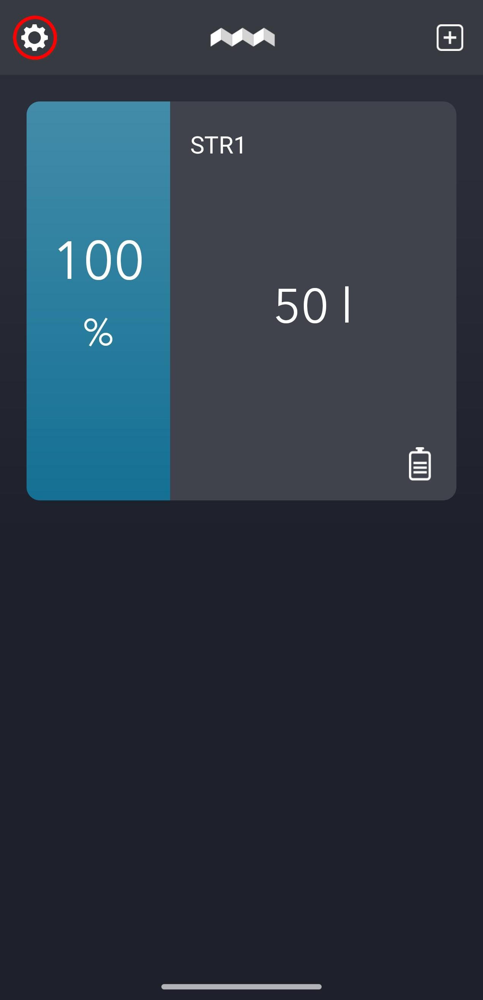
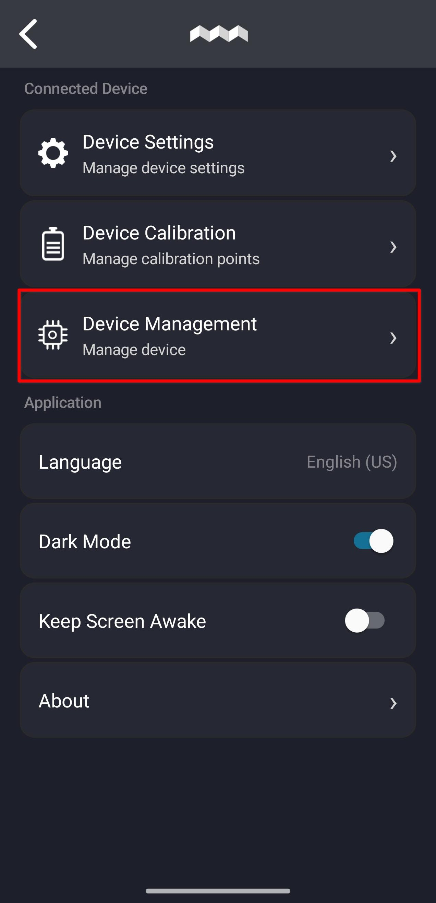
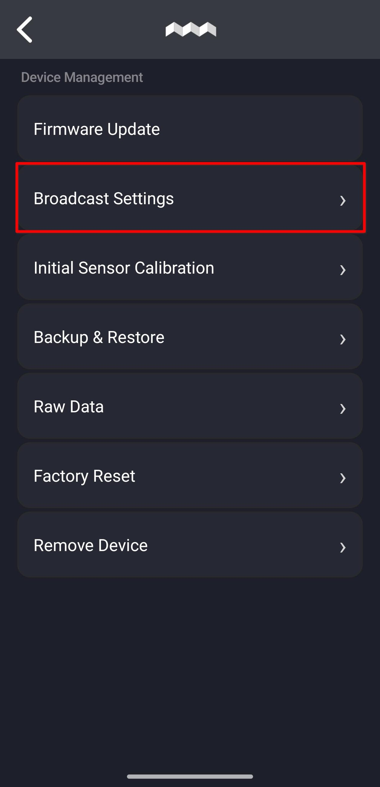
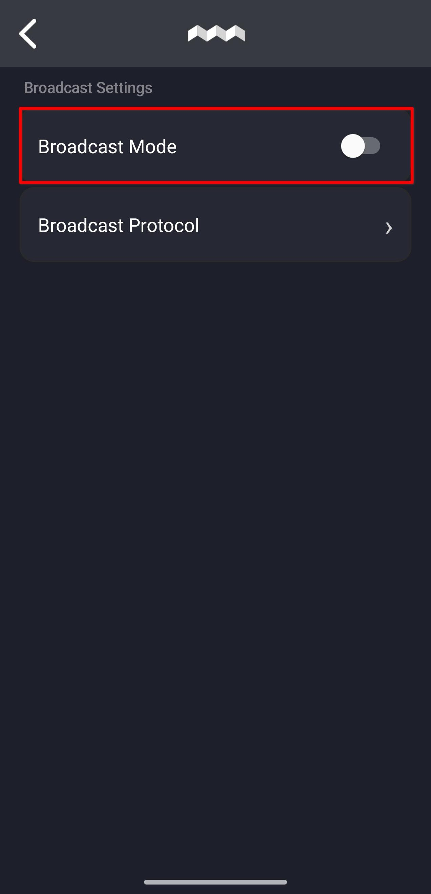
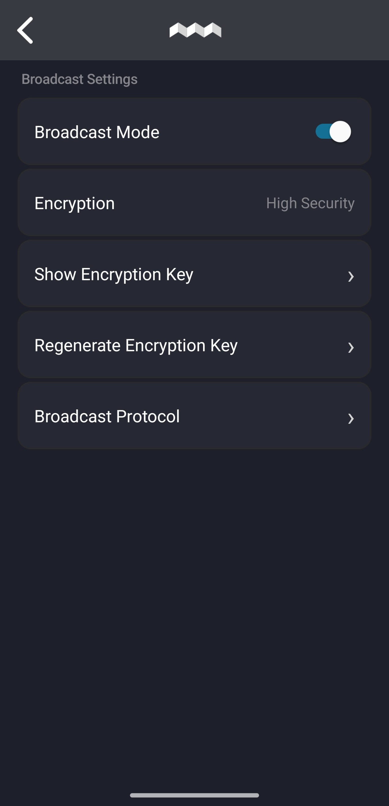
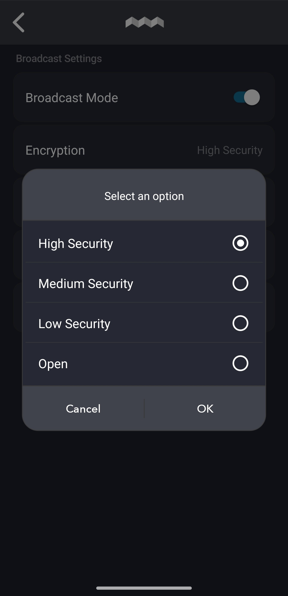
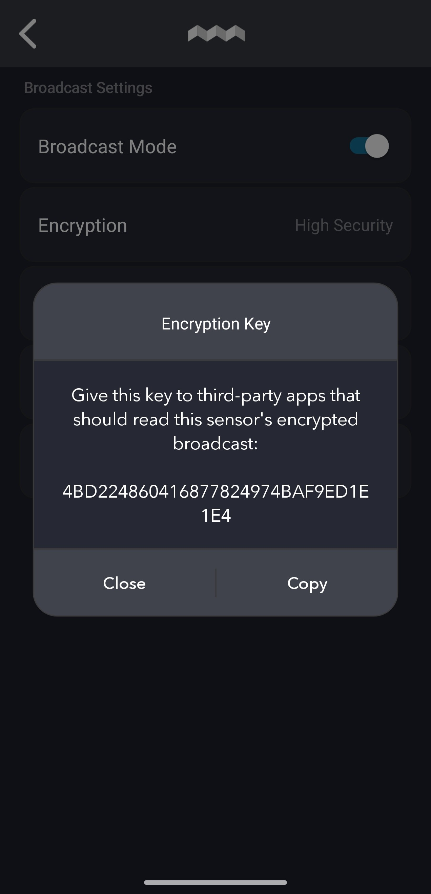
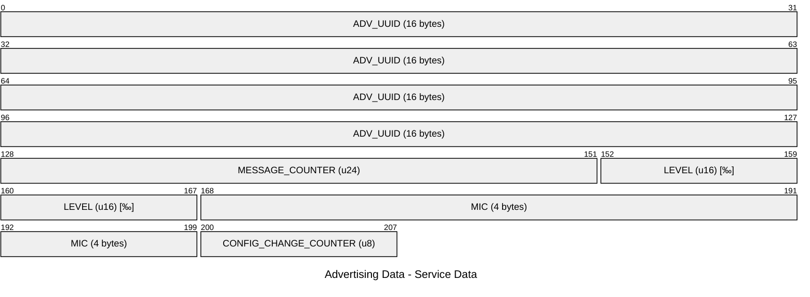
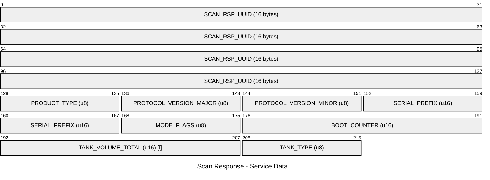
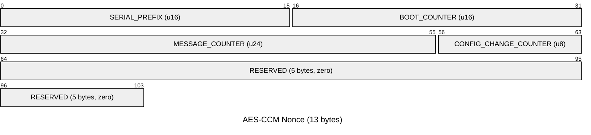

<!-- Public specification of the STRx BLE broadcast. Keep the version in the title equal to the protocol version of the firmware it describes. This document is handed to customers and third parties on its own, so it must not refer to the connected protocol document. scripts/export-html.py renders it to a single HTML file with the images under docs/img embedded. -->

# STRx BLE Broadcasting and Device Discovery v1.9.8

This document describes how the STRx radar tank level meter announces itself over Bluetooth Low Energy and how it broadcasts the tank level: the advertising parameters, the service data UUIDs used to filter STRx devices while scanning, the layout of the advertising and scan response payloads, how the broadcast is protected, and how to build the device display name shown to the user. It covers everything a host application needs to discover a device and read the broadcast tank data without connecting to it. The broadcast is switched on, and its encryption key obtained, in the Simarine Connect app, see _Enabling the Broadcast_.

Hosts that also connect to the device to configure it need the *STRx Bluetooth Protocol* specification of the same version, which Simarine provides to integration partners.

## Device Discovery and Filtering

### Enabling the Broadcast

The broadcast is off from the factory. It is switched on per device in the Simarine Connect app
while connected to the device. Open the settings with the gear icon on the main screen, then
**Device Management -> Broadcast Settings**:

  

1. Turn **Broadcast Mode** on. The encryption entries appear once it is on:

    

2. Choose **Encryption**. The setting decides what a host can read without the key and is
   advertised back as `BEACON_MODE`, see _Broadcast Modes_:

   

   | App setting        | `BEACON_MODE`          | Readable without the key                       |
   |--------------------|------------------------|------------------------------------------------|
   | Broadcast Mode off | `BEACON_OFF`           | Tank description                               |
   | High Security      | `BEACON_HIGH_SECURITY` | Nothing                                        |
   | Medium Security    | `BEACON_MED_SECURITY`  | Tank description for one minute after a change |
   | Low Security       | `BEACON_LOW_SECURITY`  | Tank description                               |
   | Open               | `BEACON_PLAIN`         | Level and tank description                     |

3. For the three Security settings, hand the encryption key to the host: **Show Encryption Key**
   opens the **Encryption Key** dialog, which shows the key as 32 hexadecimal digits and copies it
   to the clipboard with **Copy**. The digits are the 16 key bytes in order, the first pair is
   byte 0, see _Broadcast Encryption_. Open needs no key.

   

Two actions replace the key, and every host holding the old one stops being able to read the level
until it is given the new one:

- **Regenerate Encryption Key** in Broadcast Settings.
- **Device Management -> Factory Reset**, which also restarts the counters of the broadcast, see
  _Counter Rules_.

The tank description the broadcast carries, `TANK_VOLUME_TOTAL` and `TANK_TYPE`, comes from the
full tank volume and the fluid type entered under **Device Settings**.

### Advertising Parameters

| Parameter             | Value                                                |
|-----------------------|------------------------------------------------------|
| Advertising Interval  | 62.5 - 250 ms, the controller picks within the range |
| Payload Update Period | 1000 ms, one broadcast message per second            |
| Advertising Type      | Connectable undirected (`ADV_IND`), scannable        |
| Address Type          | Identity (Public)                                    |

The two periods are different things: the controller sends the advertising packet every 62.5 to
250 ms, while the payload in it is refreshed once a second while the broadcast is on and stands
still otherwise. Every packet sent in between repeats the same message, so a scanner that wants
each message once keys on `MESSAGE_COUNTER`, not on the number of packets it hears.

The advertiser is connectable, so it stops while a host is connected: a device that another host is
already connected to does not show up in a scan.

### Filtering STRx Devices

A device announces itself with two packets, each carrying one `BT_DATA_SVC_DATA128` field under its
own UUID:

| Packet                     | UUID                                                        | Payload                           |
|----------------------------|-------------------------------------------------------------|-----------------------------------|
| Advertising (`ADV_IND`)    | `ea4a9703-a497-42a7-a177-f5a0b3214a0e` (Advertising UUID)   | Live tank level                   |
| Scan response (`SCAN_RSP`) | `ea4a96f3-a497-42a7-a177-f5a0b3214a0e` (Scan Response UUID) | Identity, flags and tank metadata |

Either UUID identifies a valid STRx device while scanning. The scan response is only returned to an
active scan (scan request), so a passive scanner sees the advertising packet alone. The two packets
belong together when they arrive from the same device address.

### Packet Conventions

All multi-byte fields are little-endian, including the 128-bit UUIDs (transmitted LSB first, i.e.
the reverse of the string form). `MODE_FLAGS` bit 0 is the least significant bit.

### Advertising Packet (ADV_IND)

| Field        | Type                | Size                           | Description                     |
|--------------|---------------------|--------------------------------|---------------------------------|
| Flags        | BT_DATA_FLAGS       | 1 byte + (2 B length & type)   | General discoverable, no BR/EDR |
| Service Data | BT_DATA_SVC_DATA128 | 26 bytes + (2 B length & type) | Advertising UUID + payload      |

`TOTAL = (1 + 2) + (26 + 2) = 31 bytes`, the whole AdvData of a legacy `ADV_IND` PDU, nothing left.

#### Advertising Service Data Layout



**Advertising UUID:** `ea4a9703-a497-42a7-a177-f5a0b3214a0e`

- `MESSAGE_COUNTER` - Incremented once per second (1 Hz) while a broadcast message goes out: the
  broadcast is on, the advertiser runs and nobody is connected. It stands still otherwise, since
  the connectable advertiser stops while a host is connected and no message goes out. Together with
  `BOOT_COUNTER` from the scan response it forms the AES-CCM nonce, and it lets the host reject
  replayed advertisements.
- `LEVEL` - Current tank level in permille (0-1000). Value `0xFFFF` indicates invalid/not
  available: the broadcast is off, the device has no valid measurement yet, or a Security mode could
  not encrypt, since the device never falls back to plaintext. See _Reading the Broadcast Level_.
- `MIC` - AES-CCM tag authenticating `LEVEL`, see _Broadcast Encryption_. Only meaningful in the
  modes that encrypt, the three `BEACON_*_SECURITY` modes; transmitted as zero in the others.
- `CONFIG_CHANGE_COUNTER` - A 4 bit counter with room for flags that may be added later:
  - b0-3 - Incremented whenever `TANK_VOLUME_TOTAL`, `TANK_TYPE` or `BEACON_MODE` changes as it
    goes out, so a field the mode withholds does not count while it stays withheld, and neither
    does the end of the `BEACON_MED_SECURITY` window, which tells a host nothing new. Persisted, so
    it survives a reboot, and starts over with a factory reset. Wraps from 15 to 0. Also part of
    the AES-CCM nonce, see _Broadcast Encryption_.

    It is in the packet a passive listener hears, so a host that sees it differ from the last value
    it holds for the device knows the scan response has changed and performs an active scan to read
    it again. Sixteen changes while a host is out of range bring it back to the value the host
    holds, so a host that has not heard the device for a while should rescan anyway.
  - b4-7 - Reserved, transmitted as 0. Hosts must mask these bits off so that future flags do not
    break parsing.

### Scan Response Packet (SCAN_RSP)

| Field        | Type                | Size                           | Description                  |
|--------------|---------------------|--------------------------------|------------------------------|
| Service Data | BT_DATA_SVC_DATA128 | 27 bytes + (2 B length & type) | Scan Response UUID + payload |

`TOTAL = 27 + 2 = 29 bytes` of the 31 bytes available in a legacy `SCAN_RSP` PDU, 2 bytes left.

#### Scan Response Service Data Layout



**Scan Response UUID:** `ea4a96f3-a497-42a7-a177-f5a0b3214a0e`

- `PRODUCT_TYPE` - Product identifier:
  - `0x01` = STR1 (Analog output)
  - `0x02` = STR2 (NMEA2000 output)
  - `0x03` = STR3 (RV-C output)

  An unknown value indicates a newer product and must not cause the device to be discarded.
- `PROTOCOL_VERSION_MAJOR` - Incremented on incompatible changes to this layout or to the connected
  protocol. A host that does not know this major version should not parse the payload beyond this
  field.
- `PROTOCOL_VERSION_MINOR` - Incremented on backward-compatible additions, typically new trailing
  fields. A host may safely ignore fields it does not recognise.
- `SERIAL_PREFIX` - Last 4 digits of the serial number (`serial_number % 10000`), range [0-9999].
  `0xFFFF` if the serial number is not provisioned yet. Rendered zero-padded to four digits, see
  _Constructing the Display Name_. It stays in the scan response by design: the display name and
  the nonce need it, and it adds no tracking beyond what the public identity address already
  allows.
- `MODE_FLAGS` - The broadcast mode, with room for flags that may be added later:
  - b0-3 `BEACON_MODE` - What the device broadcasts and how, see _Broadcast Modes_. It is the
    Broadcast Mode and Encryption setting chosen in the app, so a host reads the configured mode
    back without connecting.
  - b4-7 - Reserved, transmitted as 0. Hosts must mask these bits off so that future flags do not
    break parsing.
- `BOOT_COUNTER` - Persisted on the device and incremented before the first advertisement of a boot
  goes out, and again whenever `MESSAGE_COUNTER` wraps. It forms the high part of the AES-CCM
  nonce, so the pair only ever counts up, see _Broadcast Encryption_.
- `TANK_VOLUME_TOTAL` - Total tank volume (l): the full tank volume entered in the app, rounded
  down to whole liters. Tanks of 65535 l and more are reported as 65534, so they stay apart from
  the unknown value. `0xFFFF` if the tank is not configured yet, or withheld by
  `BEACON_HIGH_SECURITY`, and by `BEACON_MED_SECURITY` outside its one minute window.
- `TANK_TYPE` - Tank type, the fluid type chosen in the app:
  - `OTHER = 0x00` (Undefined fluid)
  - `FRESH_WATER = 0x01`
  - `GRAY_WATER = 0x02`
  - `BLACK_WATER = 0x03`
  - `FUEL = 0x04`

  `0xFF` if the tank is not configured yet, or withheld the same way as `TANK_VOLUME_TOTAL`.

### Broadcast Modes

The mode is chosen in the app, see _Enabling the Broadcast_, and advertised back as `BEACON_MODE`
in the scan response, so a host learns the mode from a scan alone.

| Value  | Mode                   | App setting        | `LEVEL`           | `TANK_VOLUME_TOTAL`, `TANK_TYPE`                          |
|--------|------------------------|--------------------|-------------------|-----------------------------------------------------------|
| `0x00` | `BEACON_OFF`           | Broadcast Mode off | `0xFFFF`, connect | Plaintext                                                 |
| `0x01` | `BEACON_HIGH_SECURITY` | High Security      | AES-CCM           | Hidden (`0xFFFF`, `0xFF`)                                 |
| `0x02` | `BEACON_MED_SECURITY`  | Medium Security    | AES-CCM           | Plaintext for one minute after a change, hidden otherwise |
| `0x03` | `BEACON_LOW_SECURITY`  | Low Security       | AES-CCM           | Plaintext                                                 |
| `0x04` | `BEACON_PLAIN`         | Open               | Plaintext         | Plaintext                                                 |

- `BEACON_OFF` (default) - The level is not broadcast: `LEVEL` is `0xFFFF` and the host has to
  connect to read live data. The advertising packet still goes out so the device stays
  discoverable, and the tank description is still in the scan response.
- `BEACON_HIGH_SECURITY` - Everything that can be encrypted is, and the two fields that cannot be are
  withheld instead, so a scan tells an eavesdropper only that an STRx is present.
- `BEACON_MED_SECURITY` - The level is readable only by a host holding the key. The tank
  description is broadcast in plaintext for one minute after a change to `TANK_VOLUME_TOTAL`,
  `TANK_TYPE` or to this mode itself, and withheld as in `BEACON_HIGH_SECURITY` otherwise.
  `CONFIG_CHANGE_COUNTER` moves when the window opens, so a listener that reacts to it reads the
  new description inside the window.
- `BEACON_LOW_SECURITY` - The level is readable only by a host holding the key, while the tank
  description stays visible to anyone.
- `BEACON_PLAIN` - No protection. Anyone in radio range can read the tank level and description
  without connecting.
- `0x05` - `0x0F` - Reserved for further broadcast modes. A host that does not recognise the value
  must not parse `LEVEL`.

`BEACON_MODE` is not authenticated, so a host that has already seen a device advertise one of the
`BEACON_*_SECURITY` modes must not accept a downgrade to `BEACON_PLAIN`.

### Broadcast Encryption

In the three `BEACON_*_SECURITY` modes the `LEVEL` field of the advertising packet is encrypted
and `MIC` carries the tag that authenticates it. In `BEACON_PLAIN` both go out unprotected and `MIC`
is transmitted as zero.

| Parameter       | Value                                                                      |
|-----------------|----------------------------------------------------------------------------|
| Algorithm       | AES-128 in CCM mode (RFC 3610)                                             |
| Key             | 128 bit, the Encryption Key shown in the app, see _Enabling the Broadcast_ |
| Plaintext       | `LEVEL`, 2 bytes, little-endian                                            |
| Nonce length    | 13 bytes (`L = 2`)                                                         |
| Tag length      | 4 bytes, transmitted as `MIC`                                              |
| Associated data | 1 byte, `BEACON_MODE`                                                      |

The 4 byte tag is the size the 31 byte advertisement can afford: a random forgery passes with
probability 2^-32 per attempt, which is ample against an attacker who gets one attempt per accepted
message, but not the 2^-128 a full tag would give. The counter rules below are what keep it at one
attempt per message, a host must not accept a message counter it has already seen.

Ciphertext and tag together are 2 + 4 bytes, which is what `LEVEL` and `MIC` hold in the advertising
packet.

#### Nonce



Every field is one the host already has after a single scan: `SERIAL_PREFIX` and `BOOT_COUNTER` come
from the scan response, `MESSAGE_COUNTER` and `CONFIG_CHANGE_COUNTER` from the advertising packet it
is verifying. `CONFIG_CHANGE_COUNTER` goes in as the byte is transmitted, with the reserved bits
`b4-7` masked off, so a flag added there later does not break verification.

The nonce is neither secret nor unpredictable, it only has to be unique: **the same key must never
encrypt twice under the same nonce**. With a 2 byte plaintext a repeat would hand an eavesdropper
the difference of two levels and open the door to forgery, so the counter rules below are part of
the protocol rather than an implementation detail.

`SERIAL_PREFIX` is in the nonce so that two devices which end up sharing a key cannot collide even
when their counters line up.

The fields fill 8 of the 13 bytes. An 8 byte nonce would be legal too, but `L = 2` is the profile
every implementation supports, and since the nonce is never transmitted the reserved bytes cost
nothing and leave room for a further field without changing the CCM parameters.

`CONFIG_CHANGE_COUNTER` is in the nonce so that a message and the configuration it was broadcast
under verify together: a host that pairs an old level with a newer scan response fails the tag.

#### Associated Data

One byte, `BEACON_MODE` as the scan response carries it, with the reserved bits `b4-7` masked off.
It is authenticated but not encrypted.

The mode is the one thing worth binding that the nonce does not already carry. Identity and counters
are in the nonce, and CCM covers the nonce in the tag, so repeating them as associated data would
add nothing.

Binding the mode means a change between two `BEACON_*_SECURITY` modes on the air makes the tag fail
to verify. A downgrade to `BEACON_PLAIN` cannot be caught this way, since that mode carries
no tag at all, which is why _Broadcast Modes_ asks the host to refuse the downgrade itself.

#### Counter Rules

`MESSAGE_COUNTER` advances once per second and is 24 bit, so it wraps after roughly 194 days of
uninterrupted broadcasting. `BOOT_COUNTER` is therefore an epoch counter rather than strictly a boot
counter: the device increments and persists it on every boot **and** whenever `MESSAGE_COUNTER`
wraps. The two together count up monotonically and give 2^40 messages per key.

When `BOOT_COUNTER` itself wraps, after 65536 epochs, nonces start repeating under the same key.
The device does not replace the key by itself, so the key has to be regenerated before then with
**Regenerate Encryption Key** in the app. At one epoch per boot, or per 194 days of uninterrupted
broadcasting, this is not reached in practice.

A factory reset puts `BOOT_COUNTER` back to zero, and is only allowed to do so because it replaces
the key in the same operation, see _Enabling the Broadcast_. Counters may restart because the key
they were paired with is gone; restarting them under the old key would repeat nonces.

A host must reject any message whose `(BOOT_COUNTER, MESSAGE_COUNTER)` pair is not newer than the
last one it accepted from that device, and has to be given the key again after a factory reset:
the device it knew now broadcasts under a new key and counters that start from zero. Note that the
advertising interval is shorter than the message interval, so the same message is broadcast several
times before the counter moves on: repeats of the counter last accepted are expected and are not
replays.

### Reading the Broadcast Level

`LEVEL` carries a value only while the broadcast is on; with Broadcast Mode off it is transmitted
as `0xFFFF` and the host must connect to read live data.

The tank volume in liters is derived by the host as `LEVEL / 1000 × TANK_VOLUME_TOTAL`, using
`TANK_VOLUME_TOTAL` from the scan response. In `BEACON_HIGH_SECURITY`, and in `BEACON_MED_SECURITY`
outside its window, that field is withheld, so the host can show a percentage but no volume until it
connects.

### Constructing the Display Name

Neither the advertising packet nor the scan response carries a name AD type, the 31 available bytes
are used for service data instead. The host application therefore derives the display name from the
scan response payload:

```text
<PRODUCT_NAME>-<SERIAL_PREFIX>
```

`PRODUCT_NAME` is mapped from `PRODUCT_TYPE`:

| `PRODUCT_TYPE` | `PRODUCT_NAME` |
|----------------|----------------|
| `0x01`         | `STR1`         |
| `0x02`         | `STR2`         |
| `0x03`         | `STR3`         |

`SERIAL_PREFIX` is rendered as **four decimal digits, zero-padded**. The device transmits
`serial_number % 10000`, so a serial ending in `0042` arrives as the value `42` and must still be
displayed as `0042` to match the label printed on the device.

**Examples:**

| `PRODUCT_TYPE` | `SERIAL_PREFIX` | Display name |
|----------------|-----------------|--------------|
| `0x01`         | `1234`          | `STR1-1234`  |
| `0x02`         | `5678`          | `STR2-5678`  |
| `0x03`         | `42`            | `STR3-0042`  |

This provides users with a unique identifier matching the physical device label.

**Edge cases:**

- `SERIAL_PREFIX = 0xFFFF` - Serial number not yet provisioned. Show the product name alone.
- Unknown `PRODUCT_TYPE` - A newer product than the host knows about. Fall back to `STRx` rather
  than discarding the device, so it stays selectable.

Once connected, the standard GATT Device Name characteristic (`0x2A00`) returns the product name
directly and can be used instead of the `PRODUCT_TYPE` mapping.
